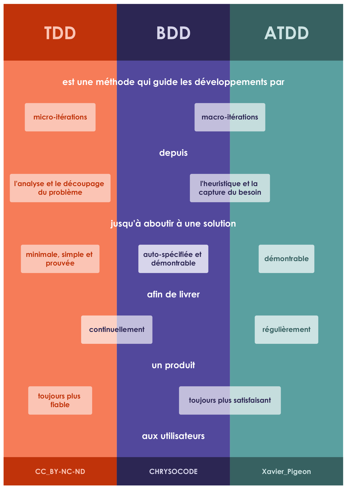
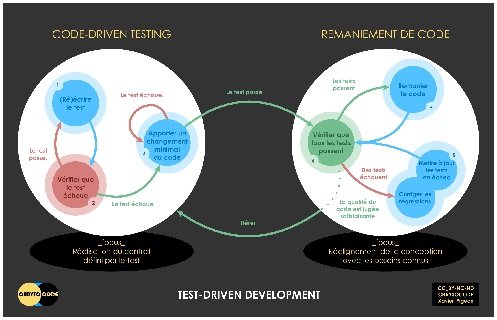
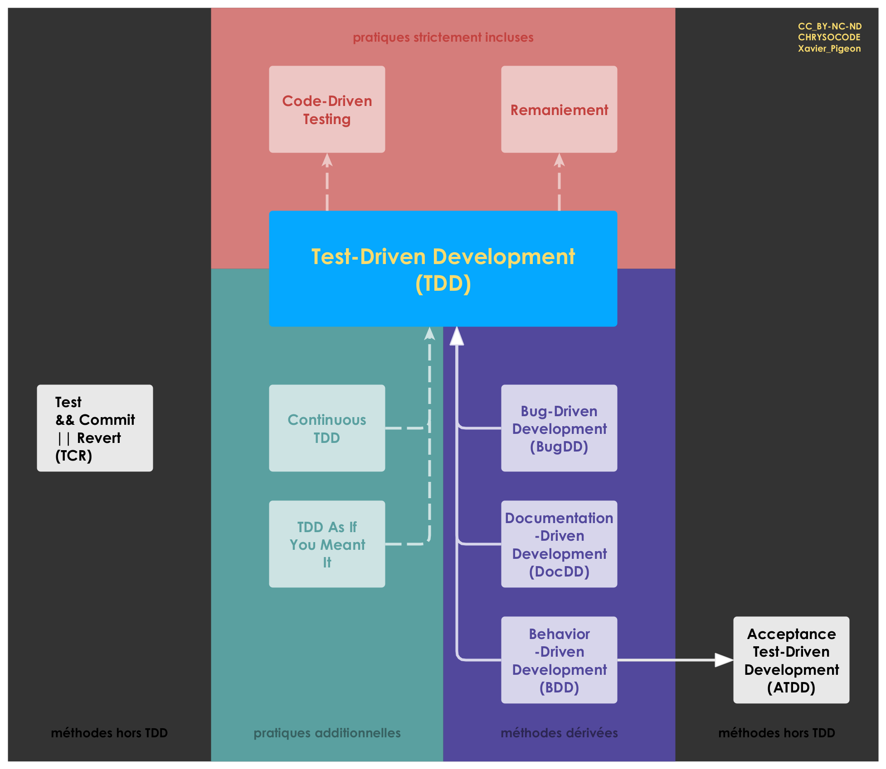
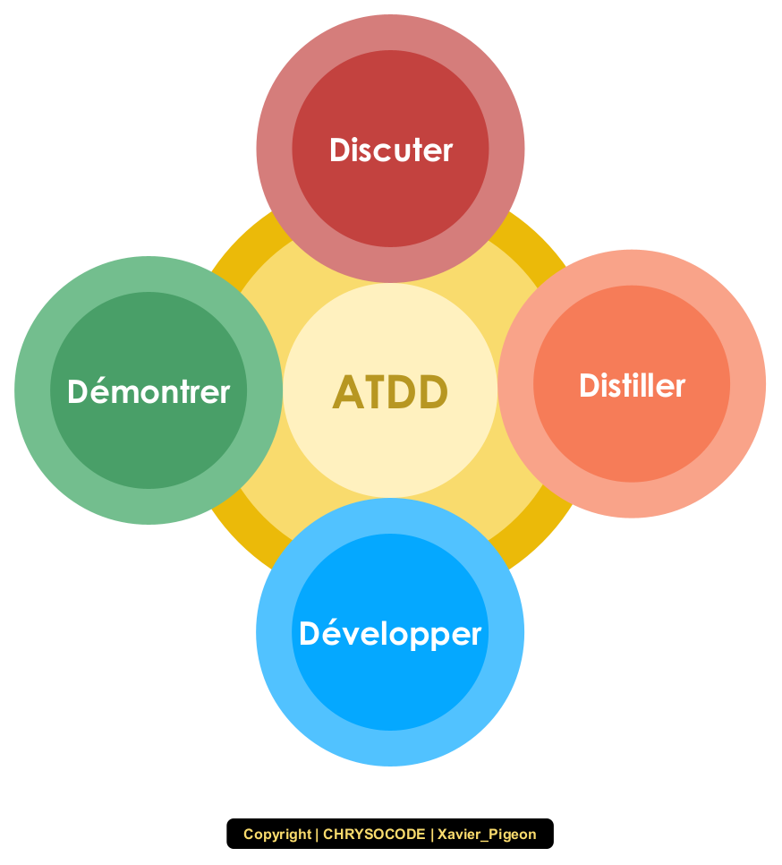

Les concepts-clés à propos des méthodes itératives et incrémentales de développement que sont TDD, ATDD et BDD sont (ou seront) réunis sur [Star-Driven Development](https://stardd.chrysocode.io/).

-- Xavier Pigeon

- Table des matières
{:toc}

# Comment ces méthodes sont-elles devenues incontournables ?

La question n'est plus de savoir pourquoi il faudrait s'y intéresser, mais plutôt de comprendre ce qu'elles permettent de faire.

## Un monde complexe et ambigü

En environnement complexe, il n'y a plus une solution pour un problème, mais une multitude de solutions possibles. Et bien souvent, le problème reste à découvrir, à questionner. Redéfinir le problème d'origine dans un cadre différent ouvre de nouvelles perspectives et permet d'envisager des solutions novatrices. Formuler des hypothèses pour explorer des solutions potentielles, c'est se donner des chances de découvrir une meilleure solution, voire de relever un défi qui paraissait insurmontable au départ.

Comment se positionner soi-même, un collègue ou des collaborateurs au sujet des métiers dans le développement de logiciels, en faisant abstraction des titres de postes, des diplômes, des textes de loi et conventions collectives, pour se focaliser seulement sur les aptitudes réelles ou une situation professionnelle donnée ?

Ingénieur logiciel | Développeur
------------------ | ------------
découvrir/questionner le problème | comprendre le problème posé
redéfinir le cadre du problème |
découper le problème | identifier des tâches
formuler des hypothèses |
explorer des solutions | trouver une solution
prouver et simplifier sa solution | vérifier sa solution

Face à la complexité, la simplicité est notre salut. Face à l'ambiguïté, sa complice, l'heuristique est notre meilleure alliée.

> La simplicité est la sophistication suprême. -- Léonard de Vinci

## Un monde volatile et incertain

# Test-Driven Development (TDD)

## Définition de TDD

TDD est une méthode qui guide les développements par micro-itérations depuis l'analyse et le découpage du problème jusqu'à aboutir à une solution minimale, simple et prouvée, afin de livrer continuellement un produit toujours plus fiable aux utilisateurs.

## Rouge-Vert-Remaniement

> Tout code est coupable jusqu'à preuve de son innocence. -- Mantra de TDD

- Rouge ! C'est un moment primordial de TDD, où nous nous projetons dans l'espace du problème.
- Vert ! C'est un moment central de TDD, où nous nous projetons dans l'espace de la solution.
- Remaniement ! C'est un moment charnière de TDD, où nous nous préparons déjà pour le prochain cycle.

## Pilliers de TDD

TDD repose sur cinq [pilliers][TDD Manifesto/Values] qui changent radicalement la manière de développer des logiciels.
1. Des petits pas plutôt que des changements de grande ampleur.
2. Un remaniement continuel plutôt que des améliorations tardives.
3. Une conception qui émerge au fil du temps plutôt qu'une conception globale en amont.
4. Une documentation exécutable plutôt que des documents statiques.
5. Un code minimaliste plutôt qu'une solution plaquée or.

## Les trois lois de TDD

Ces lois énoncent les conditions à respecter en TDD pour arriver à un test qui réussit, autrement dit pour passer du rouge au vert. Elles formalisent les trois étapes à dérouler chronologiquement quand on amorce un nouveau cycle de TDD.

Loi | Formulation correcte en français et sans ambiguïté
:-: | --------------------------------------------------
1   | Écris un test qui échoue avant d’écrire le code de production correspondant.
2   | Écris une seule assertion à la fois, qui fait échouer le test ou qui échoue à la compilation.
3   | Écris le minimum de code de production pour que l'assertion du test actuellement en échec soit satisfaite.

**NB :** Ces lois expriment le minimalisme attendu du test en échec, autant que du code de production.

## Processus cyclique de TDD

Le micro-cycle de TDD se divise en deux nano-cycles : un nano-cycle de *Code-Driven Testing*, puis un nano-cycle de remaniement. C'est un processus itératif qui comporte cinq étapes.

Étape | Consigne
:---: | --------
1     | Écris un seul test qui décrit une partie du problème à résoudre.
2     | Vérifie que le test échoue, autrement dit qu'il est valide, c'est-à-dire que le code se rapportant à ce test n'existe pas.
3     | Écris juste assez de code pour que le test réussisse.
4     | Vérifie que le test passe, ainsi que les autres tests existants.
5     | Remanie le code, c'est-à-dire améliore-le sans en altérer le comportement, qu'il s'agisse du code de production ou du code de test.

## Pratiques et extensions de TDD

- Pratiques strictement incluses : TDD implique de les utiliser.
  - *Code-Driven Testing*
  - Remaniement de code
- Pratiques additionnelles : elles ne modifient pas TDD, elles y ajoutent seulement quelques éléments.
  - *Continuous TDD*
  - *TDD As If You Meant It*
  - *Transformation Priority Premise*
- Méthodes dérivées : elles héritent de TDD, en respectant son cycle, et y apportent des changements.
  - *Bug-Driven Development*
  - *Documentation-Driven Development*
  - *Behavior-Driven Development* (BDD), qui dérive à la fois de TDD et d'ATDD.
- Méthodes similaires : elles ont leur propre cycle qui les rend à la fois similaires à TDD, mais structurellement différentes.
  - *Acceptance-Test Driven Development* (ATDD)
  - *Test && Commit \|\| Revert* (TCR)

## TDDflow : versionnage avec TDD

TDDflow peut se greffer à n'importe quel modèle des flux de versionnage, tels que GrootFlow, Gitflow ou *Trunk-Based Development*. En plus de TDD, il est compatible avec *Bug-Driven Development*, *Documentation-Driven Development*, et même TCR (*Test && Commit \|\| Revert*).

# Acceptance-Test Driven Development (ATDD)

## Définition d'ATDD

ATDD est une méthode qui guide les développements par macro-itérations depuis l'heuristique et la capture du besoin jusqu'à aboutir à une solution démontrable, afin de livrer régulièrement un produit toujours plus satisfaisant aux utilisateurs.

## Cycle 4D d'ATDD

Le macro-cycle d'ATDD se déroule en 4 étapes.

À chaque itération :
1. Discuter
2. Distiller
3. Développer
4. Démontrer

# Behavior-Driven Development (BDD)

## Définition de BDD

BDD est une méthode qui guide les développements par macro-itérations depuis l'heuristique et la capture du besoin jusqu'à aboutir à une solution auto-spécifiée et démontrable, afin de livrer continuellement un produit toujours plus satisfaisant aux utilisateurs.

# Foire Aux Questions

## Faut-il se former à TDD dès le début de sa carrière ?

Quand on se forme à un langage de programmation, on écrit généralement des morceaux de code pour réaliser de toutes petites tâches, comme autant d'exercices. On a donc le choix de vérifier le résultat soit en l'affichant en console (test manuel), soit en le testant en utilisant un framework de test (test automatisé). La deuxième option est bien meilleure, car on développe deux compétences conjointement au lieu d'une, car on apprend plus vite en maîtrisant ce qu'on fait, car automatiser ses tests n'est plus un sujet tabou. Ensuite, analyser un problème en sous-problèmes et commencer à définir un sous-problème en le décrivant sous la forme d'un test automatisé, tout cela avant de foncer tête baissée dans la recherche d'une solution, c'est déjà pratiquer TDD.

Au final, viser TDD même en commençant par des petits tests automatisés sur des petits morceaux de code est à mon avis la meilleure façon d'apprendre un langage de programmation, qu'on soit junior ou sénior d'ailleurs. On peut voir fleurir beaucoup de billets ou d'articles pour dissuader les juniors de s'intéresser à TDD dès le début... Plus tôt vous adopterez cette gymnastique de l'esprit, moins vous devrez désapprendre pour réapprendre, plus vite TDD sera une évidence, la vôtre.

## Que signifie unitaire dans le contexte de TDD ?

En vérité, unitaire signifiait **assertion** quand Robert C. Martin l'a utilisé dans ses premières formulations des trois lois de TDD, entre 2005 et 2008[*][Clean Code/The Three Laws of TDD]. Toutes les confusions et le capharnaüm qui règne dans la communauté du *Software Craftsmanship* trouvent leur origine ici. Comme Robert C. Martin s'est aperçu de sa bévue, sa [dernière formulation][Martin/The Cycles of TDD] en 2014 voit le terme unitaire enfin supprimé. Car unitaire désigne et doit continuer à désigner une **unité de programmation**, de sorte que cette unité de programmation dépend en fait du paradigme de programmation (une classe en programmation orientée objet, une fonction en programmation fonctionnelle, une procédure en programmation procédurale, etc), et non des tests. Quand vous voudrez parler d'un test dont le sujet n'est pas une unité de programmation, vous devrez vous intéresser à la typologie et taxonomie des tests logiciels, afin de recourir au vocable adéquat.

Car rien de tel pour semer le chaos et la discorde que d'employer un même mot pour désigner des choses différentes.

> Mal nommer un objet, c'est ajouter au malheur de ce monde.
-- Albert Camus, Sur une philosophie de l'expression, 1944

M'étant longuement penché sur la typologie des tests, je vous recommande le terme de **test métier** pour désigner un test fonctionnel qui traverse un groupe de classes comme sujet de test et dont l'objectif est de vérifier une règle métier, d'où son nom. Test unitaire et test métier forment le groupe des tests comportementaux, car ils servent tout deux à vérifier des comportements d'un logiciel.

En pratiquant TDD, nous sommes ainsi amenés à réaliser surtout des tests métier, et plus rarement des tests unitaires, selon que nous voulons tester une règle métier complète ou un petit algorithme, le principal étant que les tests soient résilients face au remaniement de code. Bien sûr, cela n'exclut pas de recourir plus souvent à des tests unitaires pour d'autres besoins ou pour d'autres pratiques que TDD. Nous serons alors bien contents de les retrouver, indemnes et fidèles à eux-mêmes.

# Références bibliographiques

- Robert C. Martin, Clean Code, A Handbook of Agile Software Craftsmanship, 2008, p. 122
- [Robert C. Martin (Uncle Bob), The Cycles of TDD, 2014](http://blog.cleancoder.com/uncle-bob/2014/12/17/TheCyclesOfTDD.html)
- [TDD Manifesto, Values of TDD](https://tddmanifesto.com/)

[Clean Code/The Three Laws of TDD]: https://amzn.eu/d/65hsB4L "Robert C. Martin, Clean Code, A Handbook of Agile Software Craftsmanship, 2008, p. 122"

[Martin/The Cycles of TDD]: http://blog.cleancoder.com/uncle-bob/2014/12/17/TheCyclesOfTDD.html "Robert C. Martin (Uncle Bob), The Cycles of TDD, 2014"

[TDD Manifesto/Values]: https://tddmanifesto.com/ "TDD Manifesto, Values of TDD"