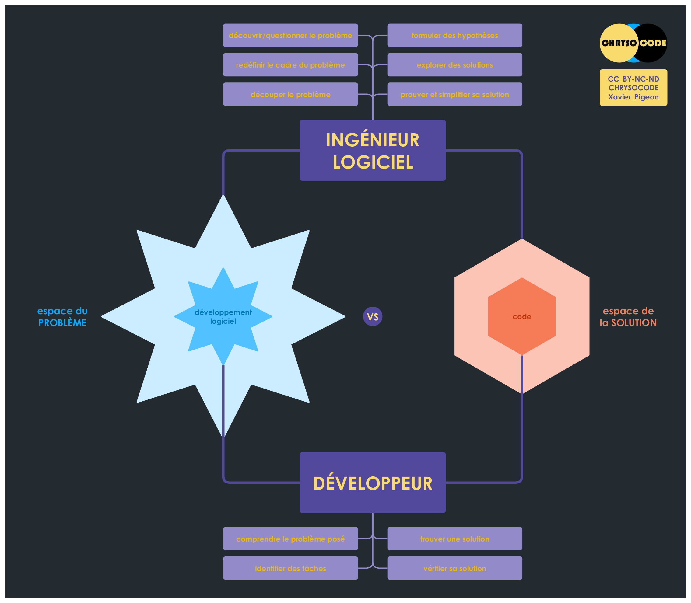
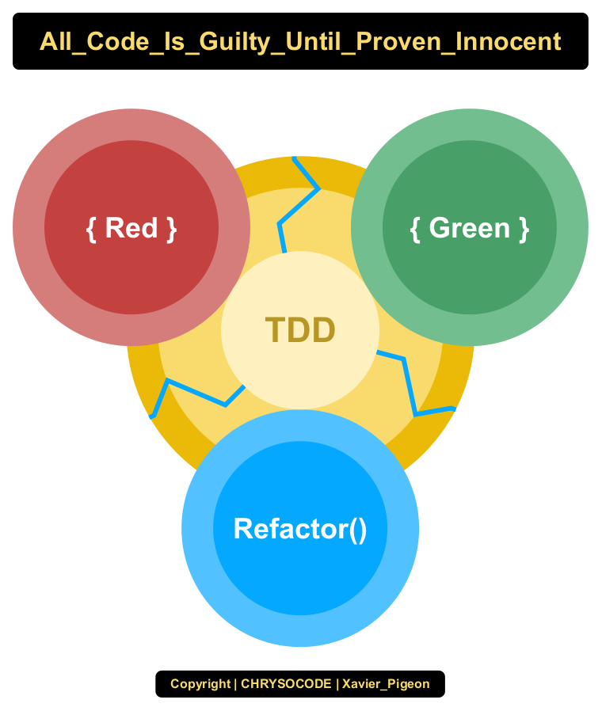
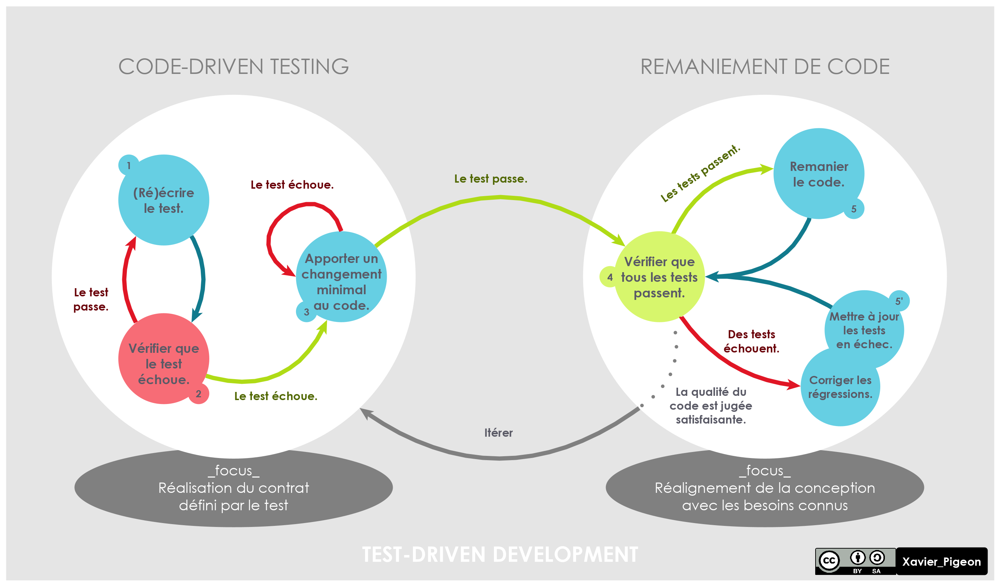
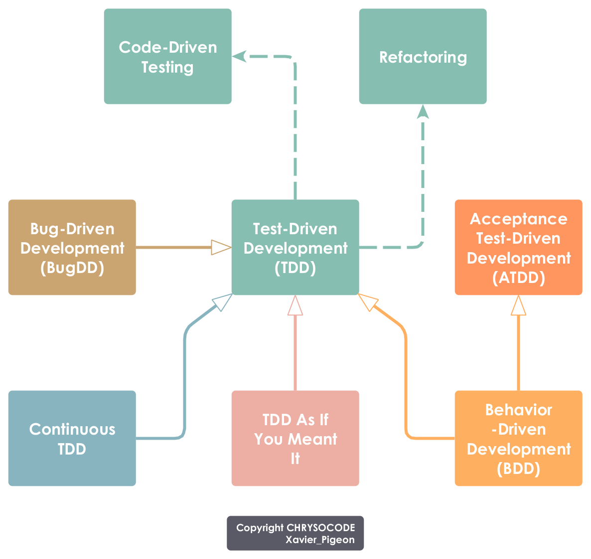

# Espace du Problème vs Espace de la Solution

En environnement complexe, il n'y a plus une solution pour un problème, mais une multitude de solutions possibles. Et bien souvent, le problème reste à découvrir, à questionner. Redéfinir le problème d'origine dans un cadre différent ouvre de nouvelles perspectives et permet d'envisager des solutions novatrices. Formuler des hypothèses pour explorer des solutions potentielles, c'est se donner des chances de découvrir une meilleure solution, voire de relever un défi qui paraissait insurmontable au départ.

Ingénieur logiciel | Développeur
------------------ | ------------
découvrir/questionner le problème | comprendre le problème posé
redéfinir le cadre du problème |
découper le problème | identifier des tâches
formuler des hypothèses |
explorer des solutions | trouver une solution
prouver et simplifier sa solution | vérifier sa solution

# Faut-il se former à TDD dès le début de sa carrière ?

Quand on se forme à un langage de programmation, on écrit généralement des morceaux de code pour réaliser de toutes petites tâches, comme autant d'exercices. On a donc le choix de vérifier le résultat soit en l'affichant en console (test manuel), soit en le testant en utilisant un framework de test (test automatisé). La deuxième option est bien meilleure, car on développe deux compétences conjointement au lieu d'une, car on apprend plus vite en maîtrisant ce qu'on fait, car automatiser ses tests n'est plus un sujet tabou. Ensuite, analyser un problème en sous-problèmes et commencer à définir un sous-problème en le décrivant sous la forme d'un test automatisé, tout cela avant de foncer tête baissée dans la recherche d'une solution, c'est déjà pratiquer TDD.

Au final, viser TDD même en commençant par des petits tests automatisés sur des petits morceaux de code est à mon avis la meilleure façon d'apprendre un langage de programmation, qu'on soit junior ou sénior d'ailleurs. On peut voir fleurir beaucoup de billets ou d'articles pour dissuader les juniors de s'intéresser à TDD dès le début... Plus tôt vous adopterez cette gymnastique de l'esprit, moins vous devrez désapprendre pour réapprendre, plus vite TDD sera votre évidence.

# Test-Driven Development (TDD)

